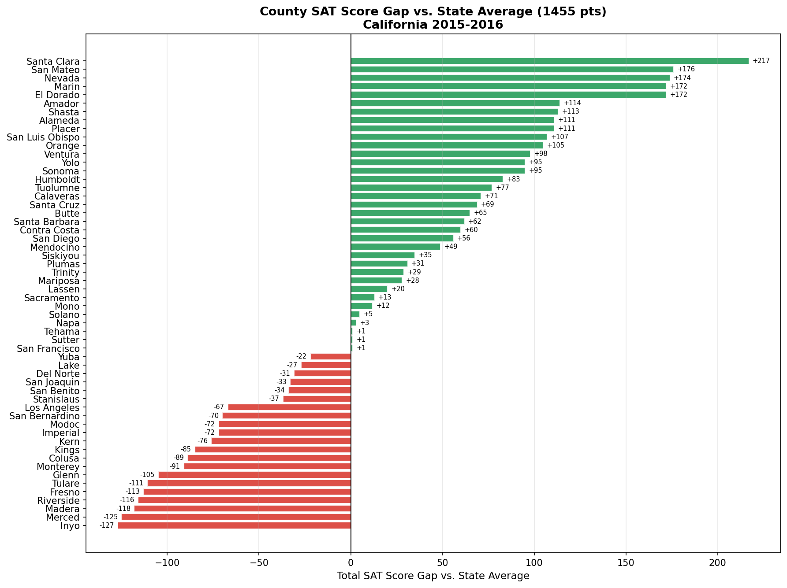

# SAT Score Gap Analyzer

This project analyzes California SAT results from the 2015-2016 academic year to surface performance gaps across counties. Using publicly available CDE (California Department of Education) data, it computes average Reading, Math, and Writing scores at the county level, compares each county against the statewide average, and visualizes the disparities through a diverging bar chart. The goal is to make score inequities immediately visible so researchers, educators, and policymakers can identify where support is most needed.

## Score Gap by County



## Key Findings

- Santa Clara County scores 344 points higher than Inyo County
- Santa Clara is +217 points above the state average of 1455
- Sierra County data was suppressed due to small enrollment

## How to Run

**Requirements:** Python 3 with `pandas`, `matplotlib`, and `numpy` installed.

```bash
pip install pandas matplotlib numpy
```

**Generate the charts:**

```bash
cd sat-score-gap-analyzer
python3 generate_charts.py
```

Charts are saved to the `assets/` folder.

**Run the notebook** (requires Jupyter):

```bash
pip install jupyter
jupyter notebook analysis.ipynb
```
